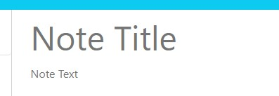
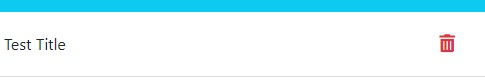

# Note Taker

## Description
The note taker application is simply designed to take, save, and delete your notes. Sticky notes are a thing of the past! I've learned quite a bit from this project. Mainly, I've learned to create routes for custom API calls that can be used by our users. Using JSON files to retreive, edit, and store data is also something that I've never tried. It's quite useful when dealing with small amounts of data without using an actual database.

## Installation
There is no installation necessary. Please go to this website to start taking your notes!

## Usage
1. Go to this website
3. Click the "Get Started" button at the center of your screen.
2. Type in the title of your note, and a description. Both are required to save your note.

    

3. Once you have content in the title and description text fields, a save button will appear at the top right corner of your screen. 

4. Click the save button, and the note will automatically transfer to your note list on the left side of your screen. 
    - If you'd prefer to start over, without saving your current note, please click the "+" button on the top right corner of your screen. The note text fields will clear, and you will be able to start your note from scratch.

5. If you'd like to see your saved notes, simply click the note title on the left side of your screen, and the saved title and description will populate in the text area.

    

Provide instructions and examples for use. Include screenshots as needed.
To add a screenshot, create an `assets/images` folder in your repository and upload your screenshot to it. Then, using the relative filepath, add it to your README using the following syntax:
